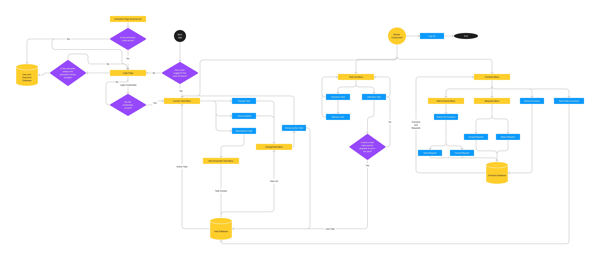
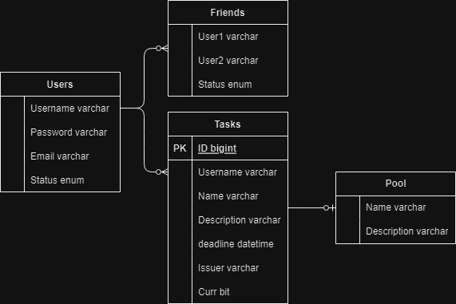

# Developer Guide for Finish Your Milk

## Design 

We mainly seperate components into one of the few components to increase maintainability:
* Menus
* Back End Function Calls (sending requests to Back End servers)
* CSS components (for css files) and Assets(for png and mp3 files)

To add a new page, under the `frontend` folder, open the `src` folder create a new file in the `Menus` folder, and modify the `routes.js` file to contain the newly created file.

The `routes.js` file should look like this:

```
export const routes = createBrowserRouter([
  {
    path: "/",
    element: <App />,
  },
    //append your new page here
  {
    path: `/page1`,
    element: <Page1 />,
  }

  ])
```
Where `Page1.js` exists in the `Menus` folder.


### User Activity Diagram



### Entity Relationship Diagram (BackEnd)



## Software Engineering Practices

### 1. Frequent communication
While this project in particular is not very large, it still is a group project nonetheless. We highly value the act of actively communicating with each other because without it there will be many conflicts during the development process and bugs will appear more often because the specifications and use cases of a function may not be stated clearly. Although the workload of the app is divided into frontend and backend, which results in virtually no merge conflicts, we still frequently communicate and check on each other’s progress on our respective parts.

### 2. Don’t Repeat Yourself (DRY)
The Don't Repeat Yourself (DRY) principle is a software development best practice that encourages developers to avoid duplicating code and information in a codebase. The principle emphasizes that each piece of knowledge or logic should have a single, unambiguous representation within the system.

In the frontend portion, The Navigation Bar and Background are often used. Therefore, we abstracted these components in their own files. We also created dedicated css files for task components, while fine tuning some components by tweaking the “styles” prop.

### 3. Modularisation
Modularization (or modular programming) is a software design and development approach that involves dividing a software system into smaller, independent, and cohesive modules or components. Each module performs a specific, well-defined function and can be developed, tested, and maintained independently. The primary goal of modularization is to create a more organized, flexible, and scalable software architecture.

In the frontend portion, we found that most pages require fetching data from an external database and rendering the fetched data, so we modularized most CRUD functions into their own JavaScript files. We also used Postman to check whether these functions work as intended.

### 4. Scalability 
Scalability refers to the ability of a software system, application, or infrastructure to handle increasing amounts of work, data, or users without compromising its performance or functionality. In other words, a scalable system can efficiently and effectively accommodate growth and increased demands without a significant drop in performance or the need for major architectural changes.

In the frontend portion, we implemented the navigation bar not only for the convenience of the user, but it also enables new features to be added to the app with relative ease. For each new feature there only needs to be one extra button on the navigation bar. Combined with the “Don’t Repeat Yourself” principle mentioned above, adding a  new feature takes significantly less work. Adding extra functionality to existing features also is as easy as adding a button on a page.

### 5. Version control 
We decided to use GitHub, a web-based hosting service and version control platform primarily used for code repositories and software development projects to track changes between versions in our code. It provides a collaborative environment for developers to work together, share code, track changes, and manage software projects efficiently. GitHub is widely used by open-source communities, individual developers, and organizations to host and collaborate on codebases.
One of the core features of git is the option to create branches so that each component can be developed individually. We eventually decided to create 2 concurrent branches, one for frontend changes and one for backend changes. The general workflow goes like this:

1. Frontend asks for function and gives specifications
2. Backend writes the function, tests it and deploys it to Azure
3. Frontend tests the function locally
4. Frontend pushes the code to github
5. Backend pushes their changes to their branch and eventually does a pull request for frontend to approve
6. Frontend eventually deploys the app to Azure

### 6. Refactoring
Refactoring code is very common in the industry. The primary objective of refactoring is to enhance the code's readability, maintainability, and performance while preserving its functionality. Refactoring is an integral part of the iterative and incremental development process and is often performed to reduce technical debt and improve code quality.

Initially, all CRUD functions were written in the Javascript components that required the data as the functions were not seemingly called in other components. This caused some inconveniences when trying to solve bugs and we eventually decided to refactor the code into their own files.
### 7. Frequent deletion of unused code
In the early stages of development where backend functions were still in progress, the frontend had to test features with custom input. This is an example of code that will have to be deleted in the future. After the backend finishes development of the function involved, test inputs will have to be deleted instantly.
Another example of this is also shown in the early stages of development, where useLocation was used to store the login state of the user instead of using JWT tokens. useLocation turned out to pose more problems and we eventually used JWT tokens in our app.

### Software Development Framework
Among common SDLC models, we decided to go with the Iterative model, which involves repeating cycles of development, where each iteration builds upon the previous one. It allows for feedback and improvements at the end of each iteration, which we prefer due to the flexibility it provides.
With each iteration, we try to add new features to existing ones, while still maintaining the correctness of existing features. This app is built incrementally, which means features are added little by little. This ensures that bugs that appear can be narrowed down to the source quite quickly when compared to deploying all changes at once. After completing each feature, we conscientiously conducted comprehensive functionality testing before moving on to the next one.

## System Testing Types

### Unit Testing
Unit testing is a software testing technique in which individual units or components of a software application are tested separately to verify that they function as intended. “Units” in this context are CRUD functions. Unit testing is typically performed by developers during the development phase to ensure the correctness of individual units before they are integrated into the larger system. 

### Integration Testing 
Integration testing is a software testing technique that focuses on verifying the interactions and integration between different modules, components, or subsystems of a software application. It aims to uncover any defects that may arise when the individual units or components are combined and tested together as a whole system.

After checking the correctness of the CRUD functions involved, we encapsulated the function into React buttons and tested how it would work with the current frontend configuration. For example, in the All Task List, we tested whether a new task would appear after adding a task through the Add Task button. If no task appeared despite giving valid input, we can conclude that the wrong lies in the method of rendering tasks instead of the method of adding a new task itself.

### Developer testing 
All testing was done manually by ourselves due to a lack of understanding of automatic testing and how to implement automation frontend-wise.
